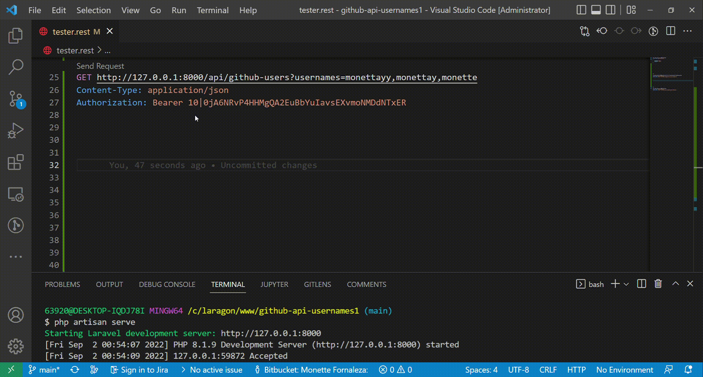

## Tech Stack

Backend: [Laravel 8](https://laravel.com/docs/8.x/readme)

Frontend: [VueJS v3](https://vuejs.org/)

## Getting Started

### Install from repository

Clone the repository:

    git clone https://github.com/monettayy/github-users.git

Navigate to the directory and run:

    composer install

Copy the example .env file:

    cp .env.example .env

Generate an application key:

    php artisan key:generate

View the website:

    php artisan serve
    
### Setup Database

Create your MySQL Database,
Go to the .env File and put your database credentials
    
    DB_DATABASE=your-database-here
    DB_USERNAME=root
    DB_PASSWORD=
    

In your terminal run:
    
    php artisan migrate
    php artisan db:seed

*This is to seed the sample admin login credentials

To login in the website, use this seeded credentials or register an account:
    
    useraname:  admin
    password:   secret

## Testing

    Challenge 1:
    POST /login                         | username, password
    POST /register                      | name, username, password, repeat_password
    GET /github-users                   | usernames 
        usernames -> string; comma separated list of username;
    
    Challenge 2:
    GET /hamming-distance/compute       | x, y

    (Sample API requests and payload can be found in tester.rest file)

Note: I only used REST Client from VS Code Extension, But can also execute to Postman, etc.

API for Login

API for Github Users

**Sample Demo**

Registration and Login

Requesting for Github User's Information

Logs for API and Redis Request

Database Design for Users

